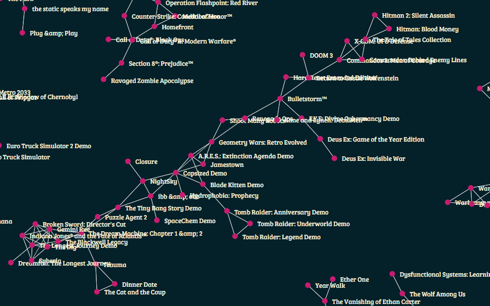

# Word2Vec for exploration of text collections

Learn Word2Vec models from a given text collection and use it as a tool to explore the relations among terms and other elements (using Doc2Vec) in that collection.
Based on gensim. 
Written for the students of my text analytics courses as a starting example of use of language models for data exploration.

## Word2Vec

### learn_word2vec.py

The **learn_word2vec.py** script learns a Word2Vec model from a text collection.

#### Required arguments

**-i \<filename>**: input text in a CSV file.

**-t \<filename>**: specifies in which column (first column has index 0) the text is.

**-o \<filename>**: the filename in which the Word2Vec model is saved.

#### Optional arguments

**-e \<encoding>**: the encoding of the input file, defautl utf-8.

**-z**: option that specifies that the input file is compressed with BZip2.

**-m \<number>**:  the minimum term frequency for the inclusion of a term in the Word2Vec vocabulary, default is 100.

**-v \<number>**: the length of the embedding vectors, default 200.

**-n \<number>**: include statistically relevant n-grams (up to the given value) in the Word2Vec vocabulary, default is no n-grams.

**-c \<number>**: specifies to process only the first c documents, for testing purposes.

### word_similarity_graph.py

The **word_similarity_graph.py** produces a visualization of the most similar terms in the Word2Vec model, by linking them if their similarity is above a given threshold.

#### Required arguments

**-i \<filename>**: input Word2Vec model file.

**-o \<dirname>**: directory name in which the visualization will be saved.

#### Optional arguments

**-s \<number from 0 to 1>**: similarity threshold for the creation of links, default: 0.8.

**-v \<number>**: vocabulary size, use only the v most frequent words, default 2000.

**-l \<language>**: language to use to remove stopwords (uses NLTK), default english.

### explore_word_embeddings.py

The **explore_word_embeddings.py** script loads a model and presents a command prompt from which the user can input a word or a set of words to get the most similar words from the model.

## Doc2Vec

### learn_doc2vec.py

The **learn_doc2vec.py** script learns a Doc2Vec model, so that additional entities external to text can be their own embeddings that are modeled with respect to the text they are associated to.

The additional required argument is:

**-a \<number> [\<number>]+**: one or more columns in which the relevant entities are stored.

### doc_similarity_graph.py

The **doc_similarity_graph.py** script works the same of the respective Word2Vec version, using the Doc2Vec entities instead of the terms.

The additional required argument is the same of the learn_doc2vec script:

**-a \<number> [\<number>]+**: one or more columns in which the relevant entities are stored.

The rationale of this parameter is that the Doc2Vec model can be learned using multiple entities of different type (from different columns) and the similarity graph can be built selecting only a specific type of entity (a single column).

## Wiki2Vec

### learn_wiki2vec.py

The **learn_wiki2vec.py** script is the same of learn_word2vec.py, but specifically designed to take in input the output of the [wikipedia-extractor](https://github.com/aesuli/wikipedia-extractor)

## Examples

[Word2Vec ran on 29M steam videogame reviews.](demo/game_w2v/index.html)

[Game similarity modeled with Doc2Vec on 29M steam videogame reviews.](demo/game_d2v/index.html)

Game reviews were downloaded using the [steam crawler](https://github.com/aesuli/steam-crawler)

[Word2Vec ran on 75k Italian reviews of restaurants in Pisa.](demo/pisa_rest_w2v/index.html)

[Similar restaurants in Pisa modeled with Doc2Vec on 75k Italian reviews of restaurants in Pisa.](demo/pisa_rest_d2v/index.html)

Restaurant reviews were downloaded using the [TripAdvisor crawler](https://github.com/aesuli/trip-advisor-crawler)
